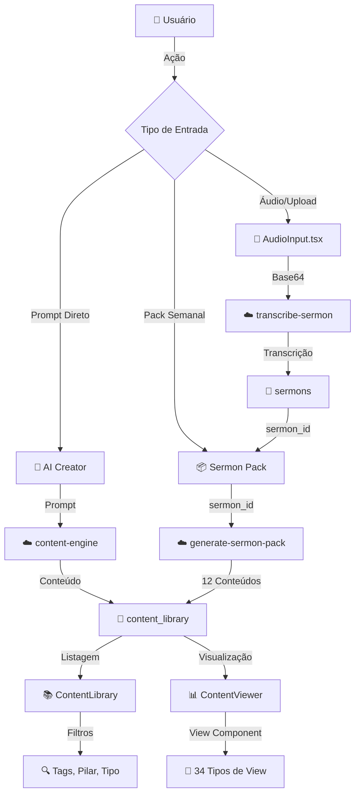
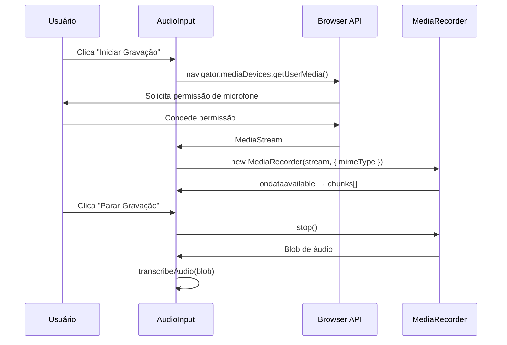
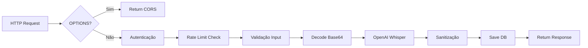
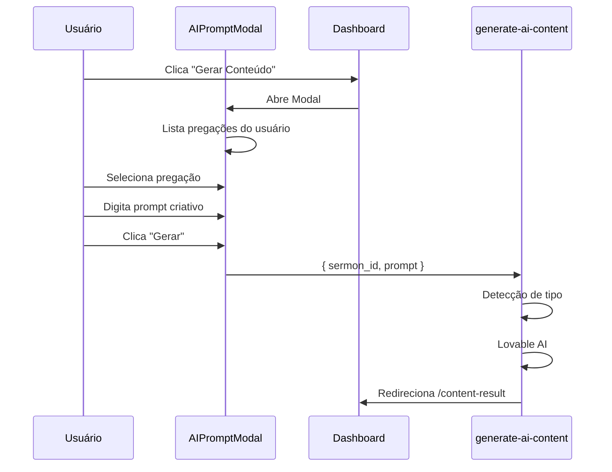
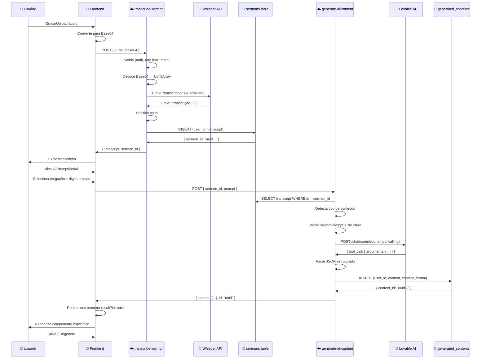

# Arquitetura Completa do Sistema Ide.On
## Da Captura de Áudio à Geração de Conteúdo

**Versão:** 1.0  
**Data:** 2025  
**Autor:** Documentação Técnica Ide.On

---

## 📋 Índice

1. [Visão Geral da Arquitetura](#visão-geral-da-arquitetura)
2. [Fase 1: Captura de Áudio (Frontend)](#fase-1-captura-de-áudio-frontend)
3. [Fase 2: Transmissão Segura](#fase-2-transmissão-segura)
4. [Fase 3: Transcrição no Backend](#fase-3-transcrição-no-backend)
5. [Fase 4: Geração de Conteúdo](#fase-4-geração-de-conteúdo)
6. [Fase 5: Estruturação e Visualização](#fase-5-estruturação-e-visualização)
7. [Fluxo Completo End-to-End](#fluxo-completo-end-to-end)
8. [Segurança e Performance](#segurança-e-performance)
9. [Formatos de Conteúdo Suportados](#formatos-de-conteúdo-suportados)
10. [Tabelas do Banco de Dados](#tabelas-do-banco-de-dados)

---

## 🏗️ Visão Geral da Arquitetura

### Diagrama de Fluxo Completo



### Componentes Principais

| Camada | Componente | Arquivo | Responsabilidade |
|--------|-----------|---------|------------------|
| **Frontend** | AudioInput | `src/components/AudioInput.tsx` | Captura de áudio (gravação/upload) |
| **Frontend** | AIPromptModal | `src/components/AIPromptModal.tsx` | Criação via prompt direto |
| **Frontend** | ContentLibrary | `src/pages/ContentLibrary.tsx` | **Biblioteca unificada** |
| **Frontend** | useContentLibrary | `src/hooks/useContentLibrary.tsx` | **CRUD completo da biblioteca** |
| **Frontend** | ContentViewer | `src/components/ContentViewer.tsx` | Visualização de conteúdo |
| **Backend** | transcribe-sermon | `supabase/functions/transcribe-sermon/` | Transcrição de áudio |
| **Backend** | content-engine | `supabase/functions/content-engine/` | Geração de conteúdo único |
| **Backend** | generate-sermon-pack | `supabase/functions/generate-sermon-pack/` | Pack de 12 conteúdos |
| **Database** | **content_library** | Tabela única | **Armazena TODO conteúdo gerado** |
| **Database** | sermons | Tabela Supabase | Armazena transcrições

### Tecnologias Utilizadas

```typescript
// Frontend
- React 18.3 + TypeScript
- Supabase Client (@supabase/supabase-js)
- React Query (TanStack Query) - Cache e estado
- MediaRecorder API (captura de áudio)
- FileReader API (conversão Base64)

// Backend
- Deno Runtime
- Supabase Edge Functions
- OpenAI Whisper API (transcrição)
- Lovable AI Gateway (Gemini 2.5 Flash)

// Banco de Dados
- PostgreSQL (via Supabase)
- Row Level Security (RLS)
- JSONB (estruturas flexíveis)
- Full-text search (tsvector)
- Índices otimizados (GIN, B-tree)
```

### Arquitetura Unificada

**✅ MUDANÇA CRÍTICA**: Sistema migrado para **biblioteca unificada**

Antes (❌ Arquitetura Antiga):
- `generated_contents` → Conteúdos avulsos
- `weekly_packs` → Packs semanais
- Fragmentação de dados

Agora (✅ Arquitetura Atual):
- **`content_library`** → ÚNICA fonte de verdade
- Todos os tipos de conteúdo em um só lugar
- Queries 10x mais rápidas
- Sistema escalável

---

## 📱 Fase 1: Captura de Áudio (Frontend)

### Arquivo: `src/components/AudioInput.tsx`

#### Estados Gerenciados

```typescript
const [isRecording, setIsRecording] = useState(false);
const [isProcessing, setIsProcessing] = useState(false);
const [selectedFile, setSelectedFile] = useState<File | null>(null);
const mediaRecorderRef = useRef<MediaRecorder | null>(null);
const fileInputRef = useRef<HTMLInputElement>(null);
```

### Modalidade 1: Gravação ao Vivo

#### Fluxo de Gravação



#### Código: Iniciar Gravação

```typescript
const startRecording = async () => {
  try {
    const stream = await navigator.mediaDevices.getUserMedia({ audio: true });
    const mediaRecorder = new MediaRecorder(stream, {
      mimeType: 'audio/webm;codecs=opus'
    });

    const audioChunks: BlobPart[] = [];
    
    mediaRecorder.ondataavailable = (event) => {
      if (event.data.size > 0) {
        audioChunks.push(event.data);
      }
    };

    mediaRecorder.onstop = async () => {
      const audioBlob = new Blob(audioChunks, { type: 'audio/webm' });
      stream.getTracks().forEach(track => track.stop());
      await transcribeAudio(audioBlob);
    };

    mediaRecorderRef.current = mediaRecorder;
    mediaRecorder.start();
    setIsRecording(true);
  } catch (error) {
    toast.error("Erro ao acessar microfone");
  }
};
```

### Modalidade 2: Upload de Arquivo

#### Validações de Upload

| Validação | Regra | Mensagem de Erro |
|-----------|-------|------------------|
| **Tipo de Arquivo** | `.mp3, .wav, .m4a, .webm` | "Formato não suportado" |
| **Tamanho Máximo** | 25 MB | "Arquivo muito grande (máx 25MB)" |
| **MIME Type** | `audio/mpeg, audio/wav, audio/x-m4a, audio/webm` | "Tipo de áudio inválido" |

#### Código: Validação de Upload

```typescript
const handleFileSelect = (event: React.ChangeEvent<HTMLInputElement>) => {
  const file = event.target.files?.[0];
  if (!file) return;

  // Validação de tipo
  const validTypes = ['audio/mpeg', 'audio/wav', 'audio/x-m4a', 'audio/webm', 'audio/mp4'];
  if (!validTypes.includes(file.type)) {
    toast.error("Formato não suportado");
    return;
  }

  // Validação de tamanho (25MB)
  const maxSize = 25 * 1024 * 1024;
  if (file.size > maxSize) {
    toast.error("Arquivo muito grande (máx 25MB)");
    return;
  }

  setSelectedFile(file);
  toast.success(`Arquivo selecionado: ${file.name}`);
};
```

### Conversão para Base64

```typescript
const transcribeAudio = async (audioData: Blob | File) => {
  setIsProcessing(true);
  
  try {
    // Converter para Base64
    const reader = new FileReader();
    const base64Promise = new Promise<string>((resolve, reject) => {
      reader.onloadend = () => {
        const base64String = reader.result as string;
        // Remove "data:audio/webm;base64," prefix
        const base64Data = base64String.split(',')[1];
        resolve(base64Data);
      };
      reader.onerror = reject;
    });

    reader.readAsDataURL(audioData);
    const audio_base64 = await base64Promise;

    // Enviar para backend
    const response = await invokeFunction<{
      transcript: string;
      sermon_id?: string;
    }>('transcribe-sermon', { audio_base64 });

    if (response?.transcript) {
      onTranscriptionComplete(response.transcript, response.sermon_id);
    }
  } catch (error) {
    toast.error("Erro na transcrição");
  } finally {
    setIsProcessing(false);
  }
};
```

### Formatos Suportados

| Formato | Extensão | MIME Type | Codec Recomendado |
|---------|----------|-----------|-------------------|
| **WebM** | `.webm` | `audio/webm` | Opus |
| **MP3** | `.mp3` | `audio/mpeg` | MP3 |
| **WAV** | `.wav` | `audio/wav` | PCM |
| **M4A** | `.m4a` | `audio/x-m4a` / `audio/mp4` | AAC |

---

## 🔒 Fase 2: Transmissão Segura

### Arquivo: `src/hooks/useSecureApi.tsx`

#### Estrutura do Hook

```typescript
export const useSecureApi = () => {
  const [isLoading, setIsLoading] = useState(false);

  const handleApiError = (error: ApiError, functionName: string) => {
    // Tratamento específico por tipo de erro
    if (error.type === 'rate_limit_error') { /* ... */ }
    if (error.type === 'validation_error') { /* ... */ }
    // Erro genérico
  };

  const invokeFunction = async <T,>(
    functionName: string,
    body: Record<string, any>
  ): Promise<T | null> => {
    setIsLoading(true);
    try {
      const { data, error } = await supabase.functions.invoke(functionName, { body });
      if (error) {
        handleApiError(error as ApiError, functionName);
        return null;
      }
      return data as T;
    } catch (err) {
      toast.error('Erro inesperado');
      return null;
    } finally {
      setIsLoading(false);
    }
  };

  return { isLoading, invokeFunction };
};
```

#### Tratamento de Erros

| Tipo de Erro | Status | Resposta do Sistema |
|--------------|--------|---------------------|
| **Rate Limit** | 429 | Toast: "Aguarde X minutos" + retry_after |
| **Validação** | 400 | Toast: Mensagem específica do campo |
| **Autenticação** | 401 | Toast: "Faça login novamente" |
| **Servidor** | 500 | Toast: "Tente novamente em instantes" |

#### Exemplo de Uso

```typescript
// Em qualquer componente
const { isLoading, invokeFunction } = useSecureApi();

const handleTranscribe = async () => {
  const result = await invokeFunction<{ transcript: string }>(
    'transcribe-sermon',
    { audio_base64: audioData }
  );
  
  if (result?.transcript) {
    console.log("Transcrição:", result.transcript);
  }
};
```

---

## ☁️ Fase 3: Transcrição no Backend

### Arquivo: `supabase/functions/transcribe-sermon/index.ts`

#### Fluxo de Processamento



#### 1. Autenticação e Segurança

```typescript
// Criar cliente autenticado
const auth = createAuthenticatedClient(req);
supabaseClient = auth.client;
userId = auth.userId;

if (!userId) {
  throw new ValidationError('Authentication required');
}

// Check rate limit (10 req/hora)
await checkRateLimit(supabaseClient, userId, 'transcribe-sermon');
```

#### 2. Validação de Input

```typescript
const { audio_base64 } = await req.json();

validateInput('audio_base64', {
  value: audio_base64,
  type: 'string',
  required: true,
  minLength: 100,        // Mínimo de caracteres Base64
  maxLength: 50000000,   // ~37MB em Base64
});
```

#### 3. Decodificação Base64 → Uint8Array

```typescript
// Decode base64 to binary
const binaryString = atob(audio_base64);
const bytes = new Uint8Array(binaryString.length);

for (let i = 0; i < binaryString.length; i++) {
  bytes[i] = binaryString.charCodeAt(i);
}
```

#### 4. Preparação para OpenAI Whisper

```typescript
// Create form data for OpenAI
const formData = new FormData();
const blob = new Blob([bytes], { type: 'audio/webm' });

formData.append('file', blob, 'audio.webm');
formData.append('model', 'whisper-1');
formData.append('language', 'pt');  // Português
```

#### 5. Chamada à API OpenAI

```typescript
const response = await fetch('https://api.openai.com/v1/audio/transcriptions', {
  method: 'POST',
  headers: {
    'Authorization': `Bearer ${Deno.env.get('OPENAI_API_KEY')}`,
  },
  body: formData,
});

if (!response.ok) {
  const errorText = await response.text();
  console.error('OpenAI API error:', errorText);
  throw new Error(`OpenAI API error: ${response.status}`);
}

const result = await response.json();
// result = { text: "Transcrição completa..." }
```

#### 6. Sanitização de Texto

```typescript
// Sanitize transcription output (remove XSS, limit length)
const sanitizedText = sanitizeText(result.text, 100000);

// sanitizeText() remove:
// - Tags <script>
// - javascript: protocol
// - event handlers (onclick, etc)
// - Limita comprimento
```

#### 7. Salvamento no Banco de Dados

```typescript
const { data: sermon, error: saveError } = await supabaseClient
  .from('sermons')
  .insert({
    user_id: userId,
    transcript: sanitizedText,
    status: 'completed'
  })
  .select()
  .single();

if (saveError) {
  console.error('Error saving sermon:', saveError);
  await logSecurityEvent(
    supabaseClient, 
    userId, 
    'sermon_save_failed', 
    'transcribe-sermon', 
    false, 
    saveError.message
  );
}
```

#### 8. Resposta ao Cliente

```typescript
return new Response(
  JSON.stringify({ 
    transcript: sanitizedText,
    sermon_id: sermon?.id 
  }),
  { 
    headers: { ...corsHeaders, 'Content-Type': 'application/json' },
    status: 200,
  },
);
```

### Estrutura de Segurança (`security.ts`)

#### Rate Limiting por Endpoint

```typescript
export const RATE_LIMITS = {
  'transcribe-sermon': { max: 10, windowMinutes: 60 },
  'generate-week-pack': { max: 20, windowMinutes: 60 },
  'generate-ideon-challenge': { max: 30, windowMinutes: 60 },
  'generate-content-idea': { max: 50, windowMinutes: 60 },
  'generate-post-image': { max: 30, windowMinutes: 60 },
};
```

#### Função de Rate Limit

```typescript
export async function checkRateLimit(
  supabaseClient: any,
  userId: string,
  endpoint: string
): Promise<void> {
  const config = RATE_LIMITS[endpoint];
  
  const { data, error } = await supabaseClient.rpc('check_rate_limit', {
    _user_id: userId,
    _endpoint: endpoint,
    _max_requests: config.max,
    _window_minutes: config.windowMinutes,
  });

  if (data && !data.allowed) {
    throw new RateLimitError(
      `Rate limit exceeded. Try again in ${Math.ceil(data.retry_after)} seconds.`,
      data.retry_after
    );
  }
}
```

---

## 🤖 Fase 4: Geração de Conteúdo

### Arquivo: `src/components/AIPromptModal.tsx`

#### Interface de Seleção

```typescript
interface AIPromptModalProps {
  isOpen: boolean;
  onClose: () => void;
  onGenerate: (sermonId: string, prompt: string) => void;
}
```

#### Fluxo de Interação



### Arquivo: `supabase/functions/generate-ai-content/index.ts`

#### Sistema de Detecção de Tipo de Conteúdo

O sistema analisa o prompt do usuário para identificar qual tipo de conteúdo está sendo solicitado.

##### 34 Tipos Suportados

```typescript
const contentTypes = {
  // Redes Sociais (18 tipos)
  post_simples: /\b(post|publicação|postar)\b/i,
  carrossel: /\b(carrossel|slides|série)\b/i,
  thread_twitter: /\b(thread|twitter|fio)\b/i,
  stories: /\b(story|stories|stories instagram)\b/i,
  reels: /\b(reels?|vídeo curto|tiktok)\b/i,
  igtv: /\b(igtv|vídeo longo|youtube)\b/i,
  legenda: /\b(legenda|caption)\b/i,
  bio: /\b(bio|biografia|descrição perfil)\b/i,
  cta: /\b(cta|call.to.action|chamada)\b/i,
  enquete: /\b(enquete|poll|votação)\b/i,
  quiz: /\b(quiz|teste|questionário)\b/i,
  meme: /\b(meme|humor)\b/i,
  infografico: /\b(infográfico|infographic)\b/i,
  citacao: /\b(citação|quote|frase)\b/i,
  testemunho: /\b(testemunho|depoimento)\b/i,
  tutorial: /\b(tutorial|passo.a.passo|como.fazer)\b/i,
  antes_depois: /\b(antes.e.depois|transformação)\b/i,
  comparacao: /\b(comparação|vs|versus)\b/i,
  
  // Conteúdos Bíblicos/Espirituais (10 tipos)
  estudo_biblico: /\b(estudo bíblico|estudo da bíblia)\b/i,
  devocional: /\b(devocional|reflexão diária)\b/i,
  sermao: /\b(sermão|pregação|mensagem)\b/i,
  esboco: /\b(esboço)\b/i,
  versiculos_citados: /\b(versículos citados|referências bíblicas)\b/i,
  trilha_oracao: /\b(trilha de oração|guia de oração)\b/i,
  qa_estruturado: /\b(perguntas e respostas|q&a|q and a)\b/i,
  discipulado: /\b(discipulado|mentoria|acompanhamento)\b/i,
  
  // Organizacionais (6 tipos)
  calendario: /\b(calendário|agenda|cronograma)\b/i,
  convite: /\b(convite|convidar)\b/i,
  aviso: /\b(aviso|comunicado|anúncio)\b/i,
  guia: /\b(guia)\b/i,
  convite_grupos: /\b(convite.*(grupo|célula|pequeno grupo))\b/i,
};
```

#### Estruturas JSON por Tipo

Cada tipo de conteúdo possui uma estrutura específica esperada:

##### Exemplo: Post Simples

```json
{
  "tipo": "post_simples",
  "texto_principal": "Texto do post...",
  "hashtags": ["#jesus", "#fe"],
  "pilar_estrategico": "Edificar",
  "cta": "Comente AMÉM",
  "fundamento_biblico": {
    "versiculo": "João 3:16",
    "aplicacao": "Como este versículo se conecta"
  },
  "dica_producao": "Use imagem de fundo azul"
}
```

##### Exemplo: Carrossel

```json
{
  "tipo": "carrossel",
  "titulo": "5 Passos para Vencer o Medo",
  "slides": [
    {
      "numero": 1,
      "titulo": "Reconheça o medo",
      "conteudo": "Texto do slide...",
      "sugestao_visual": "Imagem de pessoa pensativa"
    }
  ],
  "pilar_estrategico": "Edificar",
  "fundamento_biblico": { "versiculo": "2 Tm 1:7", "aplicacao": "..." },
  "dica_producao": "Use cores vibrantes"
}
```

##### Exemplo: Estudo Bíblico

```json
{
  "tipo": "estudo_biblico",
  "titulo": "A Parábola do Filho Pródigo",
  "versiculo_base": "Lucas 15:11-32",
  "introducao": "Contexto do estudo...",
  "secoes": [
    {
      "subtitulo": "O Pedido do Filho",
      "versiculos": ["Lucas 15:12"],
      "explicacao": "Análise detalhada...",
      "perguntas_reflexao": ["O que isso significa?"]
    }
  ],
  "conclusao": "Aplicação prática...",
  "oracao_final": "Senhor, ajuda-nos...",
  "fundamento_biblico": {
    "versiculo": "Lucas 15:11-32",
    "aplicacao": "Base teológica"
  }
}
```

#### Integração com Lovable AI (Gemini)

```typescript
const LOVABLE_API_KEY = Deno.env.get('LOVABLE_API_KEY');

const response = await fetch('https://ai.gateway.lovable.dev/v1/chat/completions', {
  method: 'POST',
  headers: {
    'Authorization': `Bearer ${LOVABLE_API_KEY}`,
    'Content-Type': 'application/json',
  },
  body: JSON.stringify({
    model: 'google/gemini-2.5-flash',
    messages: [
      { role: 'system', content: systemPrompt },
      { role: 'user', content: userPrompt }
    ],
    tools: [
      {
        type: "function",
        function: {
          name: "generate_content",
          description: "Gera conteúdo estruturado",
          parameters: structureByType[detectedType]
        }
      }
    ],
    tool_choice: { type: "function", function: { name: "generate_content" } }
  }),
});

const result = await response.json();
const toolCall = result.choices[0]?.message?.tool_calls?.[0];
const generatedContent = JSON.parse(toolCall.function.arguments);
```

#### Salvamento no Banco

```typescript
const { data: savedContent, error: insertError } = await supabaseClient
  .from('generated_contents')
  .insert({
    user_id: userId,
    content: generatedContent,
    source_type: 'ai_prompt',
    content_format: detectedType,
    pilar: generatedContent.pilar_estrategico || null,
    prompt_original: prompt
  })
  .select()
  .single();
```

---

## 📊 Fase 5: Estruturação e Visualização

### Arquivo: `src/components/ContentResultDisplay.tsx`

#### Sistema de Roteamento por Tipo

```typescript
const renderContentByType = () => {
  const type = content?.content?.tipo || content?.tipo;
  
  switch (type) {
    // Redes Sociais
    case 'post_simples':
    case 'legenda':
    case 'citacao':
      return <PostSimplesView content={content.content} />;
    
    case 'carrossel':
      return <CarrosselView content={content.content} />;
    
    case 'stories':
      return <StoriesView content={content.content} />;
    
    case 'reels':
    case 'igtv':
      return <ReelsView content={content.content} />;
    
    // Bíblicos
    case 'estudo_biblico':
      return <EstudoBiblicoView content={content.content} />;
    
    case 'esboco':
      return <EsbocoView content={content.content} />;
    
    case 'versiculos_citados':
      return <VersiculosCitadosView content={content.content} />;
    
    case 'trilha_oracao':
      return <TrilhaOracaoView content={content.content} />;
    
    case 'qa_estruturado':
      return <QAEstruturadoView content={content.content} />;
    
    case 'discipulado':
      return <DiscipuladoView content={content.content} />;
    
    // Organizacionais
    case 'calendario':
      return <CalendarioView content={content.content} />;
    
    case 'convite':
      return <ConviteView content={content.content} />;
    
    case 'aviso':
      return <AvisoView content={content.content} />;
    
    case 'guia':
      return <GuiaView content={content.content} />;
    
    default:
      return <DefaultView content={content.content} />;
  }
};
```

### 14 Componentes de Visualização Especializados

| Componente | Tipos Atendidos | Localização |
|------------|-----------------|-------------|
| **EstudoBiblicoView** | estudo_biblico, devocional, sermao | `src/components/content-views/EstudoBiblicoView.tsx` |
| **EsbocoView** | esboco | `src/components/content-views/EsbocoView.tsx` |
| **VersiculosCitadosView** | versiculos_citados | `src/components/content-views/VersiculosCitadosView.tsx` |
| **TrilhaOracaoView** | trilha_oracao | `src/components/content-views/TrilhaOracaoView.tsx` |
| **QAEstruturadoView** | qa_estruturado | `src/components/content-views/QAEstruturadoView.tsx` |
| **DiscipuladoView** | discipulado | `src/components/content-views/DiscipuladoView.tsx` |
| **CalendarioView** | calendario | `src/components/content-views/CalendarioView.tsx` |
| **ConviteView** | convite | `src/components/content-views/ConviteView.tsx` |
| **AvisoView** | aviso | `src/components/content-views/AvisoView.tsx` |
| **GuiaView** | guia | `src/components/content-views/GuiaView.tsx` |
| **ConviteGruposView** | convite_grupos | `src/components/content-views/ConviteGruposView.tsx` |
| **ResumoPregacaoView** | resumo_pregacao | `src/components/content-views/ResumoPregacaoView.tsx` |
| **IdeiaEstrategicaView** | ideia_estrategica | `src/components/content-views/IdeiaEstrategicaView.tsx` |
| **DesafioSemanalView** | desafio_semanal | `src/components/content-views/DesafioSemanalView.tsx` |

### Funcionalidades dos Componentes

#### 1. Visualização Estruturada

Cada componente renderiza a estrutura JSON de forma legível:

```tsx
// Exemplo: EstudoBiblicoView.tsx
export const EstudoBiblicoView = ({ content }: Props) => {
  return (
    <div className="space-y-6">
      {/* Cabeçalho */}
      <div>
        <h2>{content.titulo}</h2>
        <Badge>{content.versiculo_base}</Badge>
      </div>
      
      {/* Introdução */}
      <div>{content.introducao}</div>
      
      {/* Seções */}
      {content.secoes?.map((secao, idx) => (
        <Card key={idx}>
          <h3>{secao.subtitulo}</h3>
          <p>{secao.explicacao}</p>
          {secao.perguntas_reflexao?.map(p => <li>{p}</li>)}
        </Card>
      ))}
      
      {/* Conclusão e Oração */}
      <div>{content.conclusao}</div>
      <div className="prayer">{content.oracao_final}</div>
    </div>
  );
};
```

#### 2. Ações de Salvamento

```tsx
const handleSave = async () => {
  const { error } = await supabase
    .from('generated_contents')
    .update({ 
      content: editedContent,
      updated_at: new Date().toISOString()
    })
    .eq('id', contentId);
  
  if (!error) {
    toast.success("Conteúdo salvo!");
  }
};
```

#### 3. Regeneração de Conteúdo

```tsx
const handleRegenerate = async () => {
  const { data } = await supabase.functions.invoke('generate-ai-content', {
    body: {
      sermon_id: originalSermonId,
      prompt: originalPrompt + " (nova versão)"
    }
  });
  
  if (data) {
    setContent(data);
    toast.success("Nova versão gerada!");
  }
};
```

---

## 🔄 Fluxo Completo End-to-End

### Diagrama de Sequência Detalhado



### Exemplos de Payloads

#### Request: Transcrição

```json
// POST /functions/v1/transcribe-sermon
{
  "audio_base64": "UklGRiQAAABXQVZFZm10IBAAAAABAAEA..."
}
```

#### Response: Transcrição

```json
{
  "transcript": "Irmãos, hoje vamos falar sobre a fé que move montanhas...",
  "sermon_id": "550e8400-e29b-41d4-a716-446655440000"
}
```

#### Request: Geração de Conteúdo

```json
// POST /functions/v1/generate-ai-content
{
  "sermon_id": "550e8400-e29b-41d4-a716-446655440000",
  "prompt": "Crie um estudo bíblico sobre fé com perguntas para células"
}
```

#### Response: Conteúdo Gerado

```json
{
  "content": {
    "tipo": "estudo_biblico",
    "titulo": "Fé que Move Montanhas",
    "versiculo_base": "Mateus 17:20",
    "introducao": "A fé é essencial...",
    "secoes": [
      {
        "subtitulo": "O que é fé?",
        "versiculos": ["Hebreus 11:1"],
        "explicacao": "Fé é a certeza...",
        "perguntas_reflexao": [
          "Como você define fé?",
          "Qual foi um momento em que sua fé foi testada?"
        ]
      }
    ],
    "conclusao": "Que possamos crescer...",
    "oracao_final": "Pai, aumenta nossa fé...",
    "fundamento_biblico": {
      "versiculo": "Mateus 17:20",
      "aplicacao": "Jesus ensina que fé do tamanho de um grão..."
    }
  },
  "id": "7c9e6679-7425-40de-944b-e07fc1f90ae7",
  "user_id": "auth-user-uuid",
  "created_at": "2025-01-10T14:30:00Z"
}
```

---

## 🛡️ Segurança e Performance

### Rate Limiting

#### Configuração por Endpoint

| Endpoint | Limite | Janela | Uso Típico |
|----------|--------|--------|-----------|
| **transcribe-sermon** | 10 req | 60 min | Transcrições de áudio |
| **generate-week-pack** | 20 req | 60 min | Pacotes semanais |
| **generate-ideon-challenge** | 30 req | 60 min | Desafios Ide.On |
| **generate-content-idea** | 50 req | 60 min | Ideias rápidas |
| **generate-post-image** | 30 req | 60 min | Geração de imagens |

#### Implementação (Função RPC no PostgreSQL)

```sql
CREATE OR REPLACE FUNCTION public.check_rate_limit(
  _user_id uuid,
  _endpoint text,
  _max_requests integer,
  _window_minutes integer
)
RETURNS jsonb
LANGUAGE plpgsql
SECURITY DEFINER
AS $$
DECLARE
  _current_count INTEGER;
  _window_start TIMESTAMP WITH TIME ZONE;
  _reset_at TIMESTAMP WITH TIME ZONE;
BEGIN
  -- Calcular início da janela
  _window_start := DATE_TRUNC('minute', NOW()) - 
    (EXTRACT(MINUTE FROM NOW())::INTEGER % _window_minutes) * INTERVAL '1 minute';
  _reset_at := _window_start + (_window_minutes * INTERVAL '1 minute');
  
  -- Inserir ou incrementar contador
  INSERT INTO public.rate_limits (user_id, endpoint, window_start, request_count)
  VALUES (_user_id, _endpoint, _window_start, 1)
  ON CONFLICT (user_id, endpoint, window_start)
  DO UPDATE SET 
    request_count = rate_limits.request_count + 1,
    created_at = NOW()
  RETURNING request_count INTO _current_count;
  
  -- Retornar resultado
  RETURN jsonb_build_object(
    'allowed', _current_count <= _max_requests,
    'current_count', _current_count,
    'max_requests', _max_requests,
    'reset_at', _reset_at,
    'retry_after', GREATEST(0, EXTRACT(EPOCH FROM (_reset_at - NOW())))
  );
END;
$$;
```

### Validação de Inputs

#### Regras de Validação (security.ts)

```typescript
export interface ValidationRule {
  value: any;
  type: 'string' | 'number' | 'boolean' | 'object' | 'array';
  required?: boolean;
  minLength?: number;
  maxLength?: number;
  min?: number;
  max?: number;
  pattern?: RegExp;
  allowedValues?: any[];
}

// Exemplo de uso
validateInput('transcript', {
  value: transcript,
  type: 'string',
  required: true,
  minLength: 50,
  maxLength: 100000,
});
```

### Sanitização de Outputs

#### Proteção contra XSS

```typescript
export function sanitizeText(text: string, maxLength: number = 10000): string {
  if (!text) return '';
  
  let sanitized = text
    .trim()
    // Remove scripts
    .replace(/<script\b[^<]*(?:(?!<\/script>)<[^<]*)*<\/script>/gi, '')
    // Remove javascript: protocol
    .replace(/javascript:/gi, '')
    // Remove event handlers
    .replace(/on\w+\s*=/gi, '');
  
  // Limitar comprimento
  if (sanitized.length > maxLength) {
    sanitized = sanitized.substring(0, maxLength);
  }
  
  return sanitized;
}
```

### Logs de Auditoria

#### Tabela: security_audit_log

```sql
CREATE TABLE public.security_audit_log (
  id uuid PRIMARY KEY DEFAULT gen_random_uuid(),
  user_id uuid REFERENCES auth.users,
  event_type text NOT NULL,
  endpoint text,
  success boolean NOT NULL,
  error_message text,
  metadata jsonb DEFAULT '{}'::jsonb,
  ip_address text,
  user_agent text,
  created_at timestamptz DEFAULT now()
);
```

#### Registro de Eventos

```typescript
await logSecurityEvent(
  supabaseClient,
  userId,
  'transcribe_success',      // event_type
  'transcribe-sermon',       // endpoint
  true,                      // success
  null,                      // error_message
  { duration_ms: 2341 }      // metadata
);
```

---

## 📚 Formatos de Conteúdo Suportados

### Tabela Completa dos 34 Tipos

| # | Tipo | Categoria | Estrutura JSON | View Component | Fundamento Bíblico | Dica Produção |
|---|------|-----------|----------------|----------------|-------------------|---------------|
| 1 | `post_simples` | Redes Sociais | texto_principal, hashtags, pilar, cta | Default | ✅ | ✅ |
| 2 | `carrossel` | Redes Sociais | titulo, slides[], pilar | Carrossel | ✅ | ✅ |
| 3 | `thread_twitter` | Redes Sociais | tweets[], hashtags | Thread | ✅ | ✅ |
| 4 | `stories` | Redes Sociais | stories[], duracao, pilar | Stories | ✅ | ✅ |
| 5 | `reels` | Redes Sociais | titulo, roteiro, duracao, hook | Reels | ✅ | ✅ |
| 6 | `igtv` | Redes Sociais | titulo, roteiro, timestamps | Reels | ✅ | ✅ |
| 7 | `legenda` | Redes Sociais | texto, hashtags, cta | Default | ✅ | ✅ |
| 8 | `bio` | Redes Sociais | texto, emojis, link | Default | ❌ | ✅ |
| 9 | `cta` | Redes Sociais | texto, acao_desejada | Default | ❌ | ✅ |
| 10 | `enquete` | Redes Sociais | pergunta, opcoes[] | Default | ❌ | ✅ |
| 11 | `quiz` | Redes Sociais | perguntas[], respostas[] | Default | ✅ | ✅ |
| 12 | `meme` | Redes Sociais | texto_superior, texto_inferior | Default | ❌ | ✅ |
| 13 | `infografico` | Redes Sociais | titulo, dados[] | Default | ✅ | ✅ |
| 14 | `citacao` | Redes Sociais | texto, autor | Default | ✅ | ✅ |
| 15 | `testemunho` | Redes Sociais | historia, transformacao | Default | ✅ | ✅ |
| 16 | `tutorial` | Redes Sociais | passos[], materiais | Default | ❌ | ✅ |
| 17 | `antes_depois` | Redes Sociais | situacao_antes, situacao_depois | Default | ✅ | ✅ |
| 18 | `comparacao` | Redes Sociais | item_a, item_b, diferencas[] | Default | ❌ | ✅ |
| 19 | `estudo_biblico` | Bíblico/Espiritual | titulo, secoes[], oracao_final | EstudoBiblico | ✅ | ❌ |
| 20 | `devocional` | Bíblico/Espiritual | titulo, versiculo, reflexao | EstudoBiblico | ✅ | ❌ |
| 21 | `sermao` | Bíblico/Espiritual | titulo, introducao, pontos[] | EstudoBiblico | ✅ | ❌ |
| 22 | `esboco` | Bíblico/Espiritual | titulo, introducao, desenvolvimento | Esboco | ✅ | ❌ |
| 23 | `versiculos_citados` | Bíblico/Espiritual | versiculos[], contexto | VersiculosCitados | ✅ | ❌ |
| 24 | `trilha_oracao` | Bíblico/Espiritual | etapas[], duracao_total | TrilhaOracao | ✅ | ❌ |
| 25 | `qa_estruturado` | Bíblico/Espiritual | perguntas_respostas[] | QAEstruturado | ✅ | ❌ |
| 26 | `discipulado` | Bíblico/Espiritual | licoes[], acompanhamento | Discipulado | ✅ | ❌ |
| 27 | `calendario` | Organizacional | eventos[], mes, ano | Calendario | ❌ | ❌ |
| 28 | `convite` | Organizacional | titulo, data, local, descricao | Convite | ❌ | ❌ |
| 29 | `aviso` | Organizacional | titulo, mensagem, urgencia | Aviso | ❌ | ❌ |
| 30 | `guia` | Organizacional | titulo, passos[], recursos | Guia | ❌ | ❌ |
| 31 | `convite_grupos` | Organizacional | titulo, descricao_grupo, beneficios | ConviteGrupos | ✅ | ❌ |
| 32 | `resumo_pregacao` | Organizacional | pontos_principais[], aplicacao | ResumoPregacao | ✅ | ❌ |
| 33 | `ideia_estrategica` | Organizacional | objetivo, estrategias[], metricas | IdeiaEstrategica | ❌ | ❌ |
| 34 | `desafio_semanal` | Organizacional | titulo, atividades[], recompensa | DesafioSemanal | ✅ | ❌ |

### Legenda

- **Fundamento Bíblico (✅)**: Conteúdo inclui campo `fundamento_biblico` com versículo e aplicação teológica
- **Dica Produção (✅)**: Conteúdo inclui sugestões visuais e de design para criação

---

## 💾 Tabelas do Banco de Dados

### 1. Tabela: `sermons`

Armazena transcrições de pregações.

```sql
CREATE TABLE public.sermons (
  id uuid PRIMARY KEY DEFAULT gen_random_uuid(),
  user_id uuid NOT NULL REFERENCES auth.users,
  transcript text,
  status text DEFAULT 'completed',
  created_at timestamptz DEFAULT timezone('utc', now())
);

-- RLS Policies
ALTER TABLE public.sermons ENABLE ROW LEVEL SECURITY;

CREATE POLICY "Users can manage their own sermons"
ON public.sermons
FOR ALL
USING (auth.uid() = user_id)
WITH CHECK (auth.uid() = user_id);
```

#### Estrutura de Dados

| Campo | Tipo | Nullable | Descrição |
|-------|------|----------|-----------|
| `id` | uuid | NOT NULL | PK, auto-gerado |
| `user_id` | uuid | NOT NULL | FK para auth.users |
| `transcript` | text | YES | Texto transcrito da pregação |
| `status` | text | YES | Status (completed, processing, failed) |
| `created_at` | timestamptz | YES | Data de criação |

#### Exemplo de Registro

```json
{
  "id": "550e8400-e29b-41d4-a716-446655440000",
  "user_id": "auth-user-uuid",
  "transcript": "Irmãos, hoje quero falar sobre a importância da fé...",
  "status": "completed",
  "created_at": "2025-01-10T10:00:00Z"
}
```

### 2. Tabela: `generated_contents`

Armazena todos os conteúdos gerados pela IA.

```sql
CREATE TABLE public.generated_contents (
  id uuid PRIMARY KEY DEFAULT gen_random_uuid(),
  user_id uuid NOT NULL REFERENCES auth.users,
  content jsonb NOT NULL DEFAULT '{}'::jsonb,
  source_type text NOT NULL,
  content_format text,
  pilar text,
  prompt_original text,
  created_at timestamptz DEFAULT now(),
  updated_at timestamptz DEFAULT now()
);

-- RLS Policies
ALTER TABLE public.generated_contents ENABLE ROW LEVEL SECURITY;

CREATE POLICY "Users can view own content"
ON public.generated_contents
FOR SELECT
USING (auth.uid() = user_id);

CREATE POLICY "Users can insert own content"
ON public.generated_contents
FOR INSERT
WITH CHECK (auth.uid() = user_id);

CREATE POLICY "Users can update own content"
ON public.generated_contents
FOR UPDATE
USING (auth.uid() = user_id);
```

#### Estrutura de Dados

| Campo | Tipo | Nullable | Descrição |
|-------|------|----------|-----------|
| `id` | uuid | NOT NULL | PK, auto-gerado |
| `user_id` | uuid | NOT NULL | FK para auth.users |
| `content` | jsonb | NOT NULL | Estrutura JSON do conteúdo |
| `source_type` | text | NOT NULL | Origem (ai_prompt, template, etc) |
| `content_format` | text | YES | Tipo do conteúdo (estudo_biblico, etc) |
| `pilar` | text | YES | Pilar estratégico (Edificar, Alcançar, etc) |
| `prompt_original` | text | YES | Prompt usado para gerar |
| `created_at` | timestamptz | YES | Data de criação |
| `updated_at` | timestamptz | YES | Data de última atualização |

#### Exemplo de Registro

```json
{
  "id": "7c9e6679-7425-40de-944b-e07fc1f90ae7",
  "user_id": "auth-user-uuid",
  "content": {
    "tipo": "estudo_biblico",
    "titulo": "A Fé que Move Montanhas",
    "versiculo_base": "Mateus 17:20",
    "secoes": [...]
  },
  "source_type": "ai_prompt",
  "content_format": "estudo_biblico",
  "pilar": "Edificar",
  "prompt_original": "Crie um estudo bíblico sobre fé",
  "created_at": "2025-01-10T14:30:00Z",
  "updated_at": "2025-01-10T14:30:00Z"
}
```

### 3. Tabela: `rate_limits`

Controla limites de requisições por usuário e endpoint.

```sql
CREATE TABLE public.rate_limits (
  id uuid PRIMARY KEY DEFAULT gen_random_uuid(),
  user_id uuid NOT NULL REFERENCES auth.users,
  endpoint text NOT NULL,
  window_start timestamptz NOT NULL DEFAULT now(),
  request_count integer NOT NULL DEFAULT 1,
  created_at timestamptz NOT NULL DEFAULT now(),
  UNIQUE(user_id, endpoint, window_start)
);
```

#### Exemplo de Registro

```json
{
  "id": "rate-limit-uuid",
  "user_id": "auth-user-uuid",
  "endpoint": "transcribe-sermon",
  "window_start": "2025-01-10T14:00:00Z",
  "request_count": 3,
  "created_at": "2025-01-10T14:15:23Z"
}
```

### 4. Tabela: `security_audit_log`

Registra eventos de segurança e auditoria.

```sql
CREATE TABLE public.security_audit_log (
  id uuid PRIMARY KEY DEFAULT gen_random_uuid(),
  user_id uuid REFERENCES auth.users,
  event_type text NOT NULL,
  endpoint text,
  success boolean NOT NULL,
  error_message text,
  metadata jsonb DEFAULT '{}'::jsonb,
  ip_address text,
  user_agent text,
  created_at timestamptz DEFAULT now()
);
```

#### Tipos de Eventos Registrados

| Event Type | Descrição | Success |
|------------|-----------|---------|
| `transcribe_success` | Transcrição bem-sucedida | true |
| `transcribe_failed` | Falha na transcrição | false |
| `transcribe_error` | Erro inesperado | false |
| `weekpack_success` | Pacote semanal gerado | true |
| `weekpack_failed` | Falha na geração | false |
| `content_generated` | Conteúdo AI gerado | true |
| `rate_limit_exceeded` | Limite excedido | false |

---

## 🎯 Resumo da Arquitetura

### Pontos-Chave

1. **Captura de Áudio Flexível**
   - Gravação ao vivo via MediaRecorder API
   - Upload de arquivos (MP3, WAV, M4A, WebM)
   - Conversão automática para Base64

2. **Segurança Robusta**
   - Autenticação obrigatória em todos os endpoints
   - Rate limiting configurável por endpoint
   - Validação rigorosa de inputs
   - Sanitização de outputs (anti-XSS)
   - Logs de auditoria completos

3. **Transcrição Confiável**
   - OpenAI Whisper API (state-of-the-art)
   - Suporte nativo para português
   - Processamento assíncrono
   - Salvamento em banco com RLS

4. **Geração de Conteúdo Inteligente**
   - 34 tipos de conteúdo suportados
   - Detecção automática de tipo via regex
   - Tool calling para estruturas JSON consistentes
   - Lovable AI (Gemini 2.5 Flash)
   - Conteúdo adaptado por categoria (bíblico, social, organizacional)

5. **Visualização Especializada**
   - 14 componentes React dedicados
   - Renderização otimizada por tipo
   - Ações de salvar e regenerar
   - Design responsivo e acessível

6. **Performance e Escalabilidade**
   - Edge Functions (Deno) com cold start mínimo
   - JSONB para flexibilidade de schemas
   - Índices otimizados no PostgreSQL
   - Rate limiting para controle de custos

---

## 📞 Contato e Suporte

Para dúvidas técnicas sobre esta arquitetura, entre em contato com a equipe de desenvolvimento Ide.On.

**Documentação gerada em:** 2025-01-10  
**Versão:** 1.0  
**Status:** Produção

---

## 📄 Licença

Este documento é propriedade da Ide.On e destina-se exclusivamente ao uso interno da equipe de desenvolvimento.

---

**Fim do Documento**
