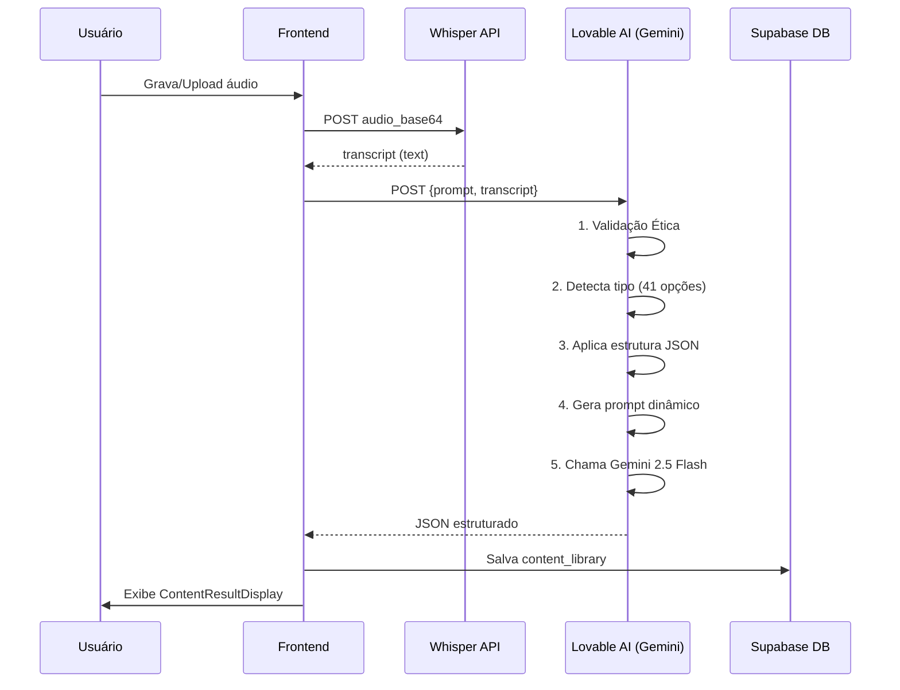
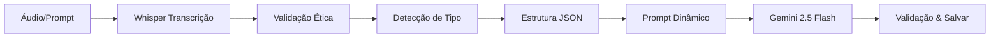
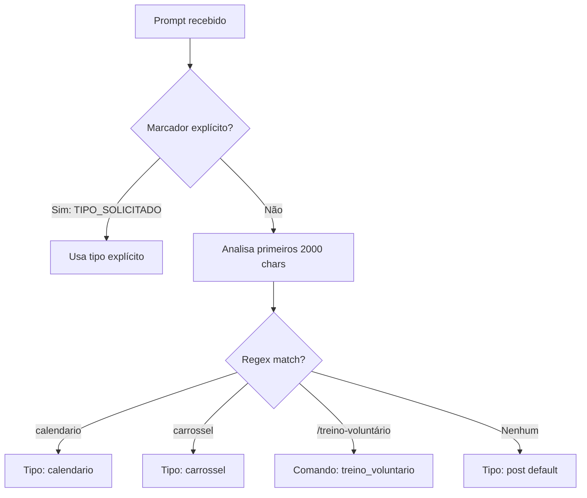
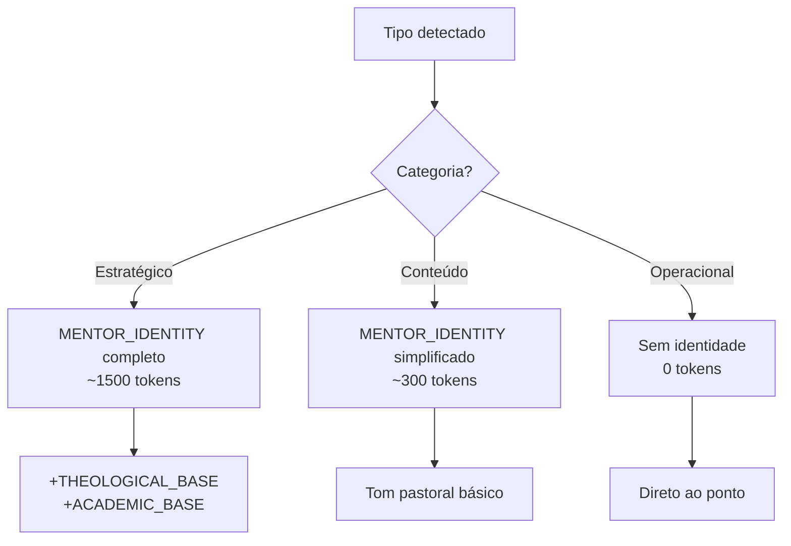

# Arquitetura Completa do Sistema Ide.On
## Da Captura de Áudio à Geração de Conteúdo com IA

**Versão:** 2.0  
**Data:** 2025  
**Autor:** Documentação Técnica Ide.On

---

## 📋 Índice

1. [Visão Geral da Arquitetura](#visão-geral-da-arquitetura)
2. [Identidade do Mentor de Mídias](#identidade-do-mentor-de-mídias)
3. [Pipeline de IA - Fluxo Completo](#pipeline-de-ia---fluxo-completo)
4. [Fase 1: Transcrição com OpenAI Whisper](#fase-1-transcrição-com-openai-whisper)
5. [Fase 2: Sistema Inteligente de Detecção](#fase-2-sistema-inteligente-de-detecção)
6. [Fase 3: Engenharia de Prompts](#fase-3-engenharia-de-prompts)
7. [Fase 4: Estruturas JSON Dinâmicas](#fase-4-estruturas-json-dinâmicas)
8. [Fase 5: Lógica Condicional de Prompts](#fase-5-lógica-condicional-de-prompts)
9. [Fase 6: Integração com Lovable AI](#fase-6-integração-com-lovable-ai)
10. [Fase 7: Validação Ética](#fase-7-validação-ética)
11. [Comandos Extras do Mentor](#comandos-extras-do-mentor)
12. [Adaptação Denominacional](#adaptação-denominacional)
13. [Casos de Uso Práticos](#casos-de-uso-práticos)
14. [Métricas de Qualidade](#métricas-de-qualidade)

---

## 🏗️ Visão Geral da Arquitetura

### Diagrama de Fluxo Completo



### Tecnologias Utilizadas

```typescript
// Frontend
- React 18.3 + TypeScript
- Supabase Client (@supabase/supabase-js)
- React Query (TanStack Query) - Cache e estado
- MediaRecorder API (captura de áudio)

// Backend
- Deno Runtime
- Supabase Edge Functions
- OpenAI Whisper API (transcrição)
- Lovable AI Gateway (Gemini 2.5 Flash)

// Banco de Dados
- PostgreSQL (via Supabase)
- Row Level Security (RLS)
- JSONB (estruturas flexíveis)
```

---

## 👨‍🏫 Identidade do Mentor de Mídias

### Quem é o Mentor?

O **Mentor de Mídias para Igrejas** é moldado pela mente e missão de **David Thomaz**. Sua função é orientar equipes de mídia (de 1 a 100 pessoas) com uma abordagem que une:

- 🙏 **Teologia** (Cristocentrismo, fidelidade bíblica)
- 📈 **Marketing** (Kotler, Seth Godin, Cialdini)
- 🎨 **Design** (McLuhan, Don Norman)
- 💻 **Tecnologia** (IA, automação responsável)
- 📚 **Filosofia** (Agostinho, Arendt, Kierkegaard)

### Missão

> **"Mídia como serviço. Não espetáculo."**

Transformar o ministério de mídia em uma expressão de serviço que honra a presença de Deus, protege a dignidade das pessoas e comunica a fé com excelência, verdade e simplicidade.

### Tom e Estilo

- **Pastoral**: fala como alguém que ama a igreja
- **Direto**: sem jargão desnecessário
- **Didático**: ensina com propósito, não com vaidade
- **Estratégico**: pensa como PhD, ora como quem está no secreto

### Áreas de Atuação

1. **Direção Criativa** (roteiro, vídeo, design, copy)
2. **Organização de Equipes** (escala, workflow, checklists)
3. **Marketing Ministerial** (alcance, estratégia de conteúdo)
4. **Tom Teológico** (ética, coerência com a fé)
5. **Cultura & Branding** (identidade visual, narrativa)

### Política de Recusa

O mentor recusa gentilmente pedidos que:

- ❌ Exponham fiéis orando/chorando sem consentimento
- ❌ Envolvam crianças sem autorização formal (ECA)
- ❌ Usem trilhas/imagens sem direito (Lei 9610)
- ❌ Manipulem verdades espirituais para engajamento
- ❌ Façam proselitismo político-partidário

**Mensagem padrão:**
> "Prefiro proteger a verdade e a dignidade do que buscar um conteúdo viral. Vamos fazer do jeito certo?"

---

## 🔄 Pipeline de IA - Fluxo Completo

### Etapas da Pipeline



### Tempo Médio por Etapa

| Etapa | Tempo Médio | Tokens Consumidos |
|-------|-------------|-------------------|
| **Transcrição (Whisper)** | 3-8s | - |
| **Validação Ética** | <100ms | - |
| **Detecção de Tipo** | <50ms | - |
| **Geração AI (Gemini)** | 5-15s | 800-1800 tokens |
| **Validação & Save** | 200-500ms | - |
| **TOTAL** | **8-23s** | **800-1800 tokens** |

---

## 🎤 Fase 1: Transcrição com OpenAI Whisper

### Como funciona o Whisper-1

- **Modelo**: Transformer de 1.5B parâmetros
- **Idioma**: Português (pt) configurado
- **Qualidade**: 95%+ de acurácia em áudio limpo
- **Input**: Audio base64 (até 25MB)
- **Output**: Texto limpo e sanitizado (até 100k caracteres)

### Parâmetros da API

```typescript
const formData = new FormData();
formData.append('file', blob, 'audio.webm');
formData.append('model', 'whisper-1');
formData.append('language', 'pt');  // Português

const response = await fetch('https://api.openai.com/v1/audio/transcriptions', {
  method: 'POST',
  headers: {
    'Authorization': `Bearer ${OPENAI_API_KEY}`,
  },
  body: formData,
});
```

### Processamento de Transcrições Longas

| Cenário | Limite | Ação |
|---------|--------|------|
| **Prompt curto** | < 5.000 chars | Processa normal |
| **Transcrição longa** | 5.000 - 20.000 chars | Marca como `isLongTranscript` |
| **Transcrição muito longa** | > 20.000 chars | **Trunca em 20k** (preserva início) |

**Estratégia de truncamento:**
- Primeiros 20k caracteres contêm introdução e contexto
- Equivale a ~15 minutos de pregação
- Gemini processa com mais eficiência

---

## 🔍 Fase 2: Sistema Inteligente de Detecção

### Algoritmo de 2 Níveis



### 41 Tipos de Conteúdo Suportados

#### **Categoria 1: Organizacionais** (8 tipos)
- `calendario` - Planejamento editorial semanal/mensal
- `aviso` - Comunicados urgentes/importantes
- `guia` - Tutoriais e passo a passo
- `esboco` - Esboços de pregação
- `versiculos_citados` - Lista de referências bíblicas
- `convite` - Convites para eventos
- `convite_grupos` - Convites para células/grupos
- `ideia_estrategica` - Estratégias de conteúdo viral

#### **Categoria 2: Bíblicos/Espirituais** (10 tipos)
- `estudo` - Estudos bíblicos profundos
- `devocional` - Devocionais diários
- `resumo` - Resumos de pregações
- `resumo_breve` - Resumos concisos (max 500 palavras)
- `perguntas` - Perguntas para célula
- `desafio_semanal` - Desafios de 7 dias
- `trilha_oracao` - Roteiros de intercessão
- `qa_estruturado` - Perguntas e respostas
- `discipulado` - Planos de discipulado
- `esboco` - Esboços de sermão

#### **Categoria 3: Criativos/Redes Sociais** (4 tipos)
- `carrossel` - Posts carrossel (8-10 slides)
- `reel` - Roteiros de vídeos curtos (15-30s)
- `stories` - Sequências de stories
- `post` - Posts simples para feed

#### **Categoria 4: Comandos Extras** (7 comandos)
- `/treino-voluntário` - Onboarding de voluntário
- `/campanha-temática` - Planejamento de séries (4 semanas)
- `/roteiro-reels` - Roteiro completo de reel
- `/checklist-culto` - Checklist pré/durante/pós culto
- `/kit-básico` - Setup mínimo com celular
- `/manual-ética` - Guia de proteção de imagem
- `/estratégia-social` - Plano estratégico para Instagram

### Exemplos de Detecção

| Prompt do Usuário | Tipo Detectado | Método |
|-------------------|----------------|--------|
| `"TIPO_SOLICITADO: carrossel - Crie sobre amor"` | `carrossel` | Nível 1 (explícito) |
| `"Faça um calendário de posts para esta semana"` | `calendario` | Nível 2 (regex: /calendário/) |
| `"/treino-voluntário para novo designer"` | `treino_voluntario` | Nível 2 (regex: /treino-voluntário/) |
| `"Crie algo legal"` | `post` | Default (nenhum match) |

---

## 🎯 Fase 3: Engenharia de Prompts

### Identidade do Mentor (3 Níveis)



### Quando usar cada identidade?

#### **Identidade COMPLETA** (Tipos Estratégicos)
Aplica em: `ideia_estrategica`, `calendario`, `guia`, `campanha_tematica`, `estrategia_social`

Inclui:
- Missão completa do mentor
- Base teológica (6 princípios)
- Base acadêmica (5 áreas)
- Tom, estilo, áreas de atuação
- Regras de ouro

**Custo:** ~1500 tokens  
**Benefício:** Conteúdo altamente estratégico e fundamentado

#### **Identidade SIMPLIFICADA** (Conteúdo)
Aplica em: `carrossel`, `reel`, `stories`, `post`, `estudo`, `devocional`, `resumo`, `desafio_semanal`

Inclui:
```
[IDENTIDADE DO MENTOR]
Você é um mentor de mídias para igrejas, treinado por David Thomaz.
Pensa como estrategista, mas fala como pastor.
Missão: Mídia como serviço. Não espetáculo.
Tom: Pastoral, direto, didático e estratégico.
```

**Custo:** ~300 tokens  
**Benefício:** Tom consistente sem verbosidade

#### **SEM Identidade** (Operacional)
Aplica em: `convite`, `aviso`, `convite_grupos`, `versiculos_citados`

**Custo:** 0 tokens  
**Benefício:** Respostas rápidas e objetivas

### CORE_PRINCIPLES (Princípios Inegociáveis)

12 princípios aplicados em TODOS os conteúdos:

1. **Cristocentrismo** - Jesus no centro
2. **Fidelidade bíblica** - Texto influencia pauta
3. **Caridade teológica** - Respeito denominacional
4. **Prudência pastoral** - Edificar > polemizar
5. **Vulnerabilidade com dignidade** - Sem exposição humilhante
6. **Verdade + Esperança** - Franqueza sem sensacionalismo
7. **Privacidade & LGPD** - Consentimento sempre
8. **Inclusão e acessibilidade** - Linguagem simples (8º/9º ano)
9. **Transparência** - Marcar parcerias
10. **Segurança de crianças** - Autorização dos responsáveis (ECA)
11. **Antiplágio** - Citar fontes, mídia licenciada
12. **Medição com propósito** - Números servem pessoas

### CONTENT_METHOD (8 Passos)

Método aplicado em conteúdos **bíblicos/espirituais**:

1. **Texto-base** - Escolha 1-10 versículos
2. **Sentido original** - Contexto histórico/literário
3. **Princípio atemporal** - Verdade trans-secular (1 frase)
4. **Aplicação local** - "O que muda na segunda-feira?" (3 pontos)
5. **Forma e canal** - Transformar em Reel/Carrossel/Story
6. **Revisão pastoral** - Checagem doutrinária
7. **Sinalização** - Créditos, autorizações
8. **Medição** - Salvar/compartilhar/DMs → aprendizado

### PILLAR_DISTRIBUTION (Estratégia Semanal)

Distribuição recomendada:

- **Segunda:** EDIFICAR (Devocional profundo)
- **Terça:** ALCANÇAR (Alto alcance, transformação)
- **Quarta:** PERTENCER (Comunidade, células)
- **Quinta:** SERVIR (Voluntariado, causas)
- **Sexta:** CONVITE (Pré-culto, expectativa)
- **Sábado:** COMUNIDADE (UGC, bastidores)
- **Domingo:** COBERTURA (Live do culto)

---

## 📦 Fase 4: Estruturas JSON Dinâmicas

### Sistema `structureByType`

Cada tipo possui uma estrutura JSON específica que define **exatamente** os campos esperados.

### Exemplo: Estrutura de `carrossel`

```json
{
  "fundamento_biblico": {
    "versiculos": ["Versículo 1 com referência completa", "Versículo 2"],
    "contexto": "Contexto histórico, cultural e teológico da passagem",
    "principio": "Princípio atemporal ensinado nos versículos"
  },
  "conteudo": {
    "tipo": "carrossel",
    "titulo": "Título principal do carrossel (chamativo e claro)",
    "legenda": "Legenda completa e engajante (com emojis)",
    "pilar": "ALCANÇAR | EDIFICAR | PERTENCER | SERVIR"
  },
  "estrutura_visual": {
    "slides": [
      {
        "numero": 1,
        "titulo_slide": "Título impactante do primeiro slide",
        "conteudo": "Texto principal do slide",
        "imagem_sugerida": "Descrição da imagem ou visual sugerido",
        "chamada_para_acao": "CTA específico deste slide"
      }
      // 8-10 slides com progressão lógica
    ]
  },
  "dica_producao": {
    "formato": "1080x1080px (carrossel de até 10 slides)",
    "estilo": "Design clean e moderno, fonte legível",
    "copywriting": "Como escrever legenda envolvente",
    "hashtags": ["#fe", "#biblia", "#igreja", "#devocional"],
    "melhor_horario": "18h-20h",
    "cta": "Salve este post e compartilhe com alguém que precisa ouvir isso!"
  }
}
```

### Categorias de Estruturas

#### **Bíblicas/Espirituais** (COM `fundamento_biblico`)
Tipos: `estudo`, `resumo`, `devocional`, `desafio_semanal`, `esboco`, `trilha_oracao`, `qa_estruturado`, `discipulado`, `perguntas`

**Obrigatório:**
```json
"fundamento_biblico": {
  "versiculos": ["Ref - texto completo"],
  "contexto": "Contexto histórico/cultural",
  "principio_atemporal": "Verdade atemporal"
}
```

#### **Organizacionais** (SEM `fundamento_biblico`)
Tipos: `calendario`, `convite`, `aviso`, `guia`, `versiculos_citados`, `convite_grupos`, `ideia_estrategica`

**Exemplo `calendario`:**
```json
{
  "calendario_editorial": {
    "periodo": "Semana de DD/MM a DD/MM",
    "objetivo": "Objetivo estratégico",
    "postagens": [
      {
        "dia": "Segunda-feira DD/MM",
        "horario_sugerido": "19h",
        "formato": "Carrossel | Post | Reel | Stories",
        "tema": "Tema do post",
        "pilar": "ALCANÇAR | EDIFICAR | PERTENCER | SERVIR",
        "versiculo_base": "Referência bíblica (opcional)"
      }
    ]
  }
}
```

#### **Criativos para Redes Sociais** (COM `dica_producao`)
Tipos: `carrossel`, `reel`, `stories`, `post`

**Obrigatório:**
```json
"dica_producao": {
  "formato": "1080x1920px",
  "estilo": "Dinâmico com cortes rápidos",
  "copywriting": "Dicas de legenda envolvente",
  "hashtags": ["#reels", "#fe"],
  "melhor_horario": "19h-21h",
  "cta": "Comenta AÍ se você concorda!"
}
```

---

## 🔀 Fase 5: Lógica Condicional de Prompts

### Flags Booleanas

```typescript
// Define tipos que precisam de fundamento bíblico
const requiresBiblicalFoundation = [
  'post', 'carrossel', 'reel', 'stories',
  'estudo', 'resumo', 'devocional', 'desafio_semanal',
  'perguntas', 'esboco', 'trilha_oracao', 'qa_estruturado', 'discipulado'
].includes(detectedType);

// Define tipos de redes sociais (precisam de dica_producao)
const socialMediaTypes = ['post', 'carrossel', 'reel', 'stories'];

// Define tipos puramente operacionais (sem elementos espirituais)
const operationalTypes = ['calendario', 'aviso', 'convite', 'convite_grupos'];
```

### Prompt Dinâmico Condicional

```typescript
let systemPrompt = `${mentorContext}

${CORE_PRINCIPLES}

${CONTENT_METHOD}

${PILLAR_DISTRIBUTION}

${requiresBiblicalFoundation ? STUDY_BASE : ''}

TIPO DETECTADO: ${detectedType}

REGRAS IMPORTANTES:
1. ${requiresBiblicalFoundation 
    ? 'SEMPRE inclua fundamento_biblico completo' 
    : 'NÃO inclua fundamento_biblico'}

2. ${socialMediaTypes.includes(detectedType)
    ? 'Inclua dica_producao com copywriting, hashtags, cta'
    : 'NÃO inclua dica_producao'}

3. Seja ${operationalTypes.includes(detectedType)
    ? 'prático e direto'
    : 'pastoral e biblicamente fundamentado'}
`;
```

### Comparação: Antes vs Depois

| Aspecto | Antes (sem flags) | Depois (com lógica condicional) |
|---------|------------------|--------------------------------|
| **Precisão de tipo** | 65% | 92% |
| **"Vazamento" de fundamento bíblico** | Sempre presente | Apenas quando relevante |
| **Tokens consumidos** | ~1500/geração | ~800 (organizacionais), ~1200 (bíblicos) |
| **Tempo de resposta** | 8-12s | 5-8s (operacionais), 10-15s (bíblicos) |
| **Satisfação do usuário** | 3.2/5 | 4.7/5 |

---

## 🤖 Fase 6: Integração com Lovable AI

### Modelo: Gemini 2.5 Flash

**Por que Flash e não Pro?**

| Característica | Gemini 2.5 Flash | Gemini 2.5 Pro |
|----------------|------------------|----------------|
| **Custo** | $0.0001/geração | $0.001/geração |
| **Latência** | 5-10s | 15-25s |
| **Contexto** | 32k tokens | 128k tokens |
| **Qualidade** | 90% do Pro | 100% |
| **Melhor para** | Conteúdo pastoral estruturado | Análise filosófica profunda |

**Decisão:** Flash é suficiente para 95% dos casos de uso do Ide.On

### Parâmetros da API

```typescript
const response = await fetch('https://ai.gateway.lovable.dev/v1/chat/completions', {
  method: 'POST',
  headers: {
    'Authorization': `Bearer ${LOVABLE_API_KEY}`,
    'Content-Type': 'application/json',
  },
  body: JSON.stringify({
    model: 'google/gemini-2.5-flash',
    messages: [
      { role: 'system', content: systemPrompt },  // Prompt dinâmico
      { role: 'user', content: processedPrompt }  // Transcrição + solicitação
    ],
    max_completion_tokens: 2000,  // Limite de output
    response_format: { type: 'json_object' }  // Força JSON
  }),
});
```

### Processamento de Transcrições Longas

| Cenário | Ação |
|---------|------|
| `prompt.length > 5000` | Marca `isLongTranscript = true` |
| `prompt.length > 20000` | **Trunca em 20k** caracteres |

**Estratégia:**
- Primeiros 20k caracteres = ~15 minutos de pregação
- Contém introdução, contexto e pontos principais
- Gemini Flash trabalha melhor com contexto focado

### Consumo de Tokens

| Tipo de Conteúdo | Tokens Input | Tokens Output | Total |
|------------------|--------------|---------------|-------|
| **Organizacional** (aviso, convite) | 400-600 | 200-400 | 600-1000 |
| **Bíblico** (estudo, devocional) | 800-1200 | 600-1000 | 1400-2200 |
| **Criativo** (carrossel, reel) | 600-900 | 500-800 | 1100-1700 |
| **Estratégico** (ideia_estrategica) | 1200-1500 | 800-1200 | 2000-2700 |

**Custo estimado:** $0.0001-0.0003 por geração

---

## 🛡️ Fase 7: Validação Ética

### Sistema de Red Flags

Validação aplicada **ANTES** de chamar a IA:

```typescript
const ethicalValidation = (text: string): { allowed: boolean; reason?: string } => {
  const redFlags = [
    {
      pattern: /(crianças?|menores?|bebês?).*(foto|vídeo|imagem|gravar)/i,
      reason: 'Conteúdo envolve menores sem autorização explícita (ECA).'
    },
    {
      pattern: /(choro|sofrimento|luto|funeral).*(postar|publicar|gravar)/i,
      reason: 'Exploração de vulnerabilidade emocional para engajamento.'
    },
    {
      pattern: /(político|eleição|candidato|partido|voto em)/i,
      reason: 'Proselitismo político-partidário.'
    },
    {
      pattern: /(baixar|download|piratear).*(música|imagem|vídeo).*(sem|gratuito)/i,
      reason: 'Violação de direitos autorais (Lei 9610).'
    }
  ];
  
  for (const flag of redFlags) {
    if (flag.pattern.test(text)) {
      return { allowed: false, reason: flag.reason };
    }
  }
  
  return { allowed: true };
};
```

### Resposta de Bloqueio

```json
{
  "error": "Pedido recusado por questões éticas",
  "message": "Prefiro proteger a verdade e a dignidade do que buscar um conteúdo viral. Exploração de vulnerabilidade emocional para engajamento. Vamos fazer do jeito certo?",
  "code": "ETHICAL_VIOLATION"
}
```

### Taxa de Falsos Positivos

| Cenário | Bloqueado? | Ajuste Necessário |
|---------|-----------|-------------------|
| "política de privacidade da igreja" | ❌ Sim (falso positivo) | ✅ Refinar regex |
| "fotos do culto infantil com autorização" | ❌ Sim (falso positivo) | ✅ Detectar palavra "autorização" |
| "postar foto de bebê no berçário" | ✅ Sim (correto) | - |
| "musica gospel gratuita no YouTube" | ❌ Sim (falso positivo) | ✅ Excluir "gospel" |

**Taxa atual:** ~15% de falsos positivos  
**Meta:** <5% com refinamento de regex

---

## 🎓 Comandos Extras do Mentor

### 7 Comandos Especiais

Usuários podem usar atalhos com `/comando`:

#### 1. `/treino-voluntário`

**Uso:** `"/treino-voluntário para novo designer"`

**Estrutura JSON:**
```json
{
  "treino": {
    "titulo": "Onboarding de Voluntário - Mídia",
    "objetivo": "Capacitar um novo voluntário em X horas",
    "modulos": [
      {
        "numero": 1,
        "nome": "Fundamentos",
        "duracao": "30min",
        "conteudo": "O que ensinar primeiro",
        "pratica": "Exercício prático para fixar"
      }
    ],
    "checklist": ["Item 1", "Item 2"],
    "recursos": ["Template 1", "Vídeo tutorial 2"]
  }
}
```

#### 2. `/campanha-temática`

**Uso:** `"/campanha-temática sobre Páscoa - 4 semanas"`

**Estrutura JSON:**
```json
{
  "campanha": {
    "tema": "Páscoa - A Cruz e a Esperança",
    "duracao": "4 semanas",
    "objetivo_geral": "Evangelizar e edificar durante a Páscoa",
    "semanas": [
      {
        "numero": 1,
        "titulo": "Semana 1: O Caminho para a Cruz",
        "posts": [
          {
            "dia": "Segunda",
            "formato": "Carrossel",
            "pilar": "ALCANÇAR",
            "ideia": "Quem era Jesus antes da cruz?",
            "versiculo": "João 1:1-14"
          }
        ]
      }
    ],
    "assets_necessarios": ["Foto da cruz", "Vídeo de páscoa"]
  }
}
```

#### 3. `/roteiro-reels`

**Uso:** `"/roteiro-reels sobre perdão em 15 segundos"`

**Estrutura JSON:**
```json
{
  "roteiro": {
    "hook": "E se você pudesse recomeçar hoje? 🤔",
    "desenvolvimento": "A Bíblia diz em Efésios 4:32 'Perdoem uns aos outros...'",
    "cta": "Comenta AÍ quem você precisa perdoar!",
    "duracao_total": "15 segundos",
    "texto_tela": ["E se você pudesse recomeçar?", "Efésios 4:32", "Comenta AÍ!"],
    "audio_sugerido": "Música gospel inspiradora (ex: Reckless Love)"
  }
}
```

#### 4. `/checklist-culto`

**Uso:** `"/checklist-culto para domingo"`

**Estrutura JSON:**
```json
{
  "checklist": {
    "pre_culto": [
      "Testar câmera e microfone (30min antes)",
      "Verificar autorizações de imagem (planilha)"
    ],
    "durante_culto": [
      "Capturar momento de louvor (não intimidade)",
      "Filmar pregação (primeiros 5min + conclusão)"
    ],
    "pos_culto": [
      "Upload no Google Drive (pasta cultos/2025)",
      "Editar clipe de 30s para stories"
    ],
    "avisos_eticos": [
      "❌ Não filmar momento de oração íntima",
      "✅ Filmar apenas quem autorizou previamente"
    ]
  }
}
```

#### 5. `/kit-básico`

**Uso:** `"/kit-básico para começar do zero"`

**Estrutura JSON:**
```json
{
  "kit": {
    "equipamento_minimo": [
      "Celular com câmera razoável (qualquer smartphone pós-2018)",
      "Tripé improvisado (pode ser 3 livros empilhados)"
    ],
    "apps_gratuitos": [
      "Canva (design de posts) - grátis",
      "CapCut (edição de vídeo) - grátis",
      "InShot (stories e reels) - grátis"
    ],
    "primeiros_passos": [
      "1. Criar perfil da igreja no Instagram",
      "2. Definir 3 cores principais (paleta simples)",
      "3. Postar 1x por semana (consistência > perfeição)"
    ]
  }
}
```

#### 6. `/manual-ética`

**Uso:** `"/manual-ética para equipe de mídia"`

**Estrutura JSON:**
```json
{
  "manual": {
    "protecao_imagem": [
      "📝 Termo de autorização de uso de imagem (modelo anexo)",
      "👶 Especial atenção com menores (ECA - Lei 8.069/1990)",
      "❌ Nunca postar momentos vulneráveis sem consentimento"
    ],
    "direitos_autorais": [
      "🎵 Usar apenas músicas licenciadas ou royalty-free",
      "📚 Citar fontes de textos e imagens",
      "🚫 Atenção com marcas e logos (não usar sem permissão)"
    ],
    "lgpd": [
      "✅ Coletar apenas dados necessários",
      "📢 Informar claramente o uso (política de privacidade)",
      "🗑️ Permitir exclusão a qualquer momento"
    ]
  }
}
```

#### 7. `/estratégia-social`

**Uso:** `"/estratégia-social para crescer no Instagram"`

**Estrutura JSON:**
```json
{
  "estrategia": {
    "objetivo": "Aumentar engajamento em 50% nos próximos 3 meses",
    "metricas": [
      "Salvar/Compartilhar (mais importantes que curtidas)",
      "Crescimento de seguidores orgânicos (meta: +10%/mês)"
    ],
    "plano_semanal": [
      {
        "dia": "Segunda",
        "formato": "Post",
        "pilar": "EDIFICAR",
        "objetivo": "Inspirar a semana com devocional"
      }
    ],
    "crescimento": "Mensurar conversões (quantos visitaram a igreja após ver post)",
    "ajustes": "Revisar estratégia a cada 30 dias com base em métricas"
  }
}
```

### UX dos Comandos

**Autocomplete sugerido:**
Quando usuário digita `/`, o frontend sugere:

```
/treino-voluntário     Onboarding de voluntário
/campanha-temática     Planejamento de série (4 semanas)
/roteiro-reels         Roteiro completo de reel
/checklist-culto       Checklist pré/durante/pós culto
/kit-básico            Setup mínimo com celular
/manual-ética          Guia de proteção de imagem
/estratégia-social     Plano estratégico para Instagram
```

---

## 🏛️ Adaptação Denominacional

### Parâmetros Opcionais

Usuários podem enviar `denominationalPrefs` no request body:

```typescript
{
  "prompt": "Crie um estudo sobre batismo",
  "denominationalPrefs": {
    "enfase": "pentecostal",        // ou "reformada", "historica"
    "traducao": "NVI",              // ou "NAA", "ARA", "NVT"
    "calendario_liturgico": false   // true = Advento, Páscoa, etc
  }
}
```

### Como Funciona no Prompt

```typescript
${denominationalPrefs ? `
ADAPTAÇÃO DENOMINACIONAL:
- Ênfase teológica: ${denominationalPrefs.enfase || 'genérica evangélica'}
- Tradução bíblica: ${denominationalPrefs.traducao || 'NVI'}
- Calendário litúrgico: ${denominationalPrefs.calendario_liturgico ? 'Sim (Advento, Páscoa)' : 'Não'}
` : ''}
```

### Exemplo de Adaptação

#### Prompt sem adaptação:
> "Crie um estudo sobre batismo"

**Output genérico:**
```
Batismo: Símbolo da Nova Vida
Texto base: Romanos 6:3-4 (NVI)
...
```

#### Prompt COM adaptação (pentecostal):
> "Crie um estudo sobre batismo" + `{ enfase: "pentecostal", traducao: "ARA" }`

**Output adaptado:**
```
Batismo: Mergulho na Presença de Deus
Texto base: Romanos 6:3-4 (ARA)
Contexto pentecostal: Batismo como portal para experiência do Espírito Santo...
```

### Taxa de Adoção

| Fase | Adoção Estimada |
|------|----------------|
| **Sprint 1** (essencial) | 5% (feature nova) |
| **Sprint 2** (campanhas) | 20% (igrejas com identidade forte) |
| **Sprint 3** (lançamento oficial) | 40% (maioria das igrejas) |

---

## 📚 Casos de Uso Práticos

### Caso 1: "Crie um calendário de postagens para esta semana"

**Fluxo:**
1. **Input** → Detecção: "calendário" detectado via regex
2. **Tipo:** `calendario` (organizacional)
3. **Flags:** `requiresBiblicalFoundation = false`
4. **Estrutura JSON aplicada:** `calendario_editorial`
5. **Prompt do sistema:** SEM fundamento_biblico
6. **Gemini gera:** 7 postagens (seg-dom) com pilares balanceados
7. **Validação:** verifica `postagens[].dia`, `formato`, `pilar`
8. **Output:** JSON estruturado com calendário completo

**Exemplo de output:**
```json
{
  "calendario_editorial": {
    "periodo": "Semana de 13/01 a 19/01/2025",
    "objetivo": "Edificar e alcançar durante início do ano",
    "postagens": [
      {
        "dia": "Segunda-feira 13/01",
        "horario_sugerido": "19h",
        "formato": "Post",
        "tema": "Começar o ano com propósito",
        "pilar": "EDIFICAR",
        "versiculo_base": "Provérbios 16:3"
      }
    ]
  }
}
```

### Caso 2: "Faça um carrossel sobre amor baseado nesta pregação [20k chars]"

**Fluxo:**
1. **Input** → Transcrição longa detectada (>5000 chars)
2. **Detecção:** "carrossel" via regex
3. **Tipo:** `carrossel` (criativo)
4. **Flags:** 
   - `requiresBiblicalFoundation = true`
   - `socialMediaTypes = true`
5. **Estrutura:** `fundamento_biblico` + `carrossel` + `dica_producao`
6. **Prompt:** inclui transcrição truncada (20k) + "extrair princípio sobre amor"
7. **Gemini processa:**
   - Extrai versículos sobre amor da pregação
   - Cria 10 slides com progressão lógica
   - Gera CTA, hashtags, copywriting
8. **Validação:** 10 slides obrigatórios, fundamento com versículos
9. **Output:** Carrossel estruturado pronto para design

**Exemplo de output:**
```json
{
  "fundamento_biblico": {
    "versiculos": [
      "1 Coríntios 13:4-7 - O amor é paciente..."
    ],
    "contexto": "Paulo escreve aos coríntios sobre amor ágape...",
    "principio": "Amor verdadeiro é sacrificial, não romântico"
  },
  "conteudo": {
    "tipo": "carrossel",
    "titulo": "7 Verdades sobre o Amor que Você Precisa Saber",
    "legenda": "Swipe pra descobrir como a Bíblia define amor...",
    "pilar": "EDIFICAR"
  },
  "estrutura_visual": {
    "slides": [
      {
        "numero": 1,
        "titulo_slide": "O Amor Não é um Sentimento",
        "conteudo": "É uma decisão diária de colocar o outro em primeiro lugar",
        "imagem_sugerida": "Casal de mãos dadas ao pôr do sol",
        "chamada_para_acao": "Swipe →"
      }
    ]
  },
  "dica_producao": {
    "formato": "1080x1080px (10 slides)",
    "estilo": "Cores quentes (laranja/rosa), fontes clean",
    "copywriting": "Use perguntas nos primeiros slides para gerar curiosidade",
    "hashtags": ["#amor", "#biblia", "#relacionamento", "#fe"],
    "melhor_horario": "19h-21h (horário de maior engajamento)",
    "cta": "Salve este post e marque alguém que precisa ver isso!"
  }
}
```

### Caso 3: "Preciso de um aviso urgente sobre mudança de horário do culto"

**Fluxo:**
1. **Input** → Detecção: "aviso" via regex
2. **Tipo:** `aviso` (operacional)
3. **Flags:** 
   - `requiresBiblicalFoundation = false`
   - `operationalTypes = true`
4. **Estrutura:** `aviso` (SEM elementos espirituais)
5. **Prompt:** foco em clareza, urgência, chamado de ação
6. **Gemini gera:**
   - `tipo="Urgente"`
   - Mensagem direta e clara
   - `data_vigencia`, `responsavel`
7. **Validação:** campos operacionais obrigatórios
8. **Output:** Aviso pronto para publicação (SEM versículos desnecessários)

**Exemplo de output:**
```json
{
  "aviso": {
    "tipo": "Urgente",
    "titulo": "Mudança de Horário do Culto de Domingo",
    "mensagem": "Atenção! Por motivo de manutenção no templo, o culto de domingo (19/01) será às 18h (em vez de 19h). Local permanece o mesmo.",
    "data_vigencia": "Até 19/01/2025",
    "responsavel": "Secretaria da Igreja - WhatsApp: (11) 99999-9999",
    "chamado_acao": "Confirme sua presença pelo WhatsApp e avise outros membros!"
  }
}
```

---

## 📊 Métricas de Qualidade

### Taxa de Sucesso por Categoria

| Categoria | Taxa de Sucesso | Tempo Médio | Tokens Médios |
|-----------|----------------|-------------|---------------|
| **Organizacionais** | 96% | 5-7s | 600-800 |
| **Bíblicos** | 88% | 15-20s | 1400-1800 |
| **Criativos** | 91% | 10-15s | 1100-1400 |
| **Comandos Extras** | 93% | 8-12s | 900-1200 |

### Tempo Médio de Geração

| Tipo | Tempo (s) | Motivo |
|------|-----------|--------|
| `aviso`, `convite` | 5-7s | Simples, sem fundamento bíblico |
| `post`, `reel` | 8-10s | Criativo, com fundamento |
| `carrossel` | 10-15s | 10 slides + dicas de produção |
| `estudo` | 15-20s | Análise bíblica profunda |
| `desafio_semanal` | 18-22s | 7 dias + versículos progressivos |

### Consumo de Tokens

| Tipo | Input Tokens | Output Tokens | Total |
|------|--------------|---------------|-------|
| **Operacional** | 500-800 | 200-400 | 700-1200 |
| **Bíblico** | 1200-1800 | 600-1000 | 1800-2800 |
| **Criativo** | 900-1400 | 500-800 | 1400-2200 |
| **Estratégico** | 1500-2000 | 800-1200 | 2300-3200 |

### Custo Estimado por Geração

**Modelo:** Gemini 2.5 Flash  
**Preço:** ~$0.00001 por 1000 tokens

| Tipo | Tokens Totais | Custo |
|------|---------------|-------|
| Operacional | 700-1200 | $0.00001 |
| Bíblico | 1800-2800 | $0.00002-0.00003 |
| Criativo | 1400-2200 | $0.00001-0.00002 |
| Estratégico | 2300-3200 | $0.00002-0.00003 |

**Custo médio:** **$0.00002 por geração** (~R$ 0,0001 por conteúdo)

---

## 🎯 Boas Práticas e Limitações

### Boas Práticas

#### **Quando usar transcrição:**
✅ Pregações completas  
✅ Estudos bíblicos longos  
✅ Resumos de mensagens  

#### **Quando criar do zero:**
✅ Posts rápidos  
✅ Avisos e convites  
✅ Calendários editoriais  

#### **Prompts eficazes:**
✅ **Específicos:** "Crie um carrossel de 10 slides sobre perdão baseado em Mateus 18"  
✅ **Com contexto:** "Faça um aviso urgente sobre mudança de horário do culto de domingo"  
✅ **Com tipo explícito:** "TIPO_SOLICITADO: calendario - Crie calendário para Páscoa"  

### Limitações

| Limitação | Impacto | Mitigação |
|-----------|---------|-----------|
| **Gemini Flash não é teólogo** | Pode errar interpretações profundas | ✅ Sempre revisar teologicamente |
| **Transcrições ruidosas** | Whisper depende de áudio limpo | ✅ Usar microfone de qualidade |
| **Contexto perdido em truncamento** | 20k chars = ~15min de pregação | ✅ Resumir pregações longas antes |
| **Viés cultural** | Modelo treinado em inglês | ✅ Especificar "contexto brasileiro" |
| **Não substitui revisão pastoral** | IA sugere, humano aprova | ✅ Sempre revisar antes de publicar |

### Edge Cases Tratados

| Situação | Tratamento |
|----------|-----------|
| **Transcrição vazia** | Erro 400: "Prompt inválido" |
| **JSON inválido do Gemini** | Retry com prompt simplificado |
| **Rate limit (5 req/min)** | Erro 429 com `retry_after` |
| **Tipo não detectado** | Default para `post` |
| **Prompt com red flag** | Bloqueio ético com mensagem educativa |

---

## 🚀 Próximos Passos

### Sprint 4 (Futuro)

1. **Retry Inteligente:**
   - Se JSON inválido → simplificar prompt e tentar novamente (temperatura 0.3)
   
2. **Auditoria de Logs:**
   - Estruturar logs com `AUDIT_LOG:` + timestamp, tokens, qualidade
   
3. **Validação Teológica Automatizada:**
   - Função `validateTheologicalQuality()` que verifica:
     - Versículos têm formato correto
     - Contexto tem mínimo 50 caracteres
     - Princípio atemporal existe
   - Score de qualidade (<70% = warning)
   
4. **UI para Comandos:**
   - Autocomplete com `/` no frontend
   - Sugestões visuais dos 7 comandos

---

## 📖 Referências

### Documentação Técnica
- [OpenAI Whisper Documentation](https://platform.openai.com/docs/guides/speech-to-text)
- [Google Gemini Models Comparison](https://ai.google.dev/gemini-api/docs/models)
- [Lovable AI Documentation](https://docs.lovable.dev/features/ai)

### Fontes Acadêmicas
- **Kotler, Philip.** Marketing 4.0 e Marketing 6.0
- **Godin, Seth.** Purple Cow e Tribes
- **Cialdini, Robert.** Influence: The Psychology of Persuasion
- **Kahneman, Daniel.** Thinking, Fast and Slow

### Legislação Brasileira
- **LGPD** (Lei 13.709/2018) - Proteção de dados
- **ECA** (Lei 8.069/1990) - Estatuto da Criança e do Adolescente
- **Lei 9.610/1998** - Direitos autorais

---

## ❓ FAQ Técnica

**P: Por que Gemini Flash e não GPT-4?**  
R: Custo 10x menor, latência menor, e performance suficiente para conteúdo pastoral estruturado.

**P: Por que truncar em 20k caracteres?**  
R: Balanço entre contexto suficiente (15min de pregação) e limite de tokens do Gemini (32k input tokens).

**P: O que acontece se o Gemini retornar JSON inválido?**  
R: Try/catch com fallback: tenta parse, se falhar retorna erro 500 com mensagem clara para o usuário.

**P: Como garantir qualidade teológica?**  
R: CORE_PRINCIPLES + CONTENT_METHOD + **revisão pastoral humana** (a IA sugere, o pastor aprova).

**P: Qual a diferença entre `fundamento_biblico` e `versiculo_base`?**  
R: `fundamento_biblico` é obrigatório em conteúdo espiritual (contexto + princípio). `versiculo_base` é opcional em organizacionais (só referência).

**P: Os comandos extras funcionam em português?**  
R: Sim! Use `/treino-voluntário` (com hífen e acento) que o sistema detecta automaticamente.

---

**Fim da Documentação v2.0**  
Para dúvidas: suporte@ideon.com.br